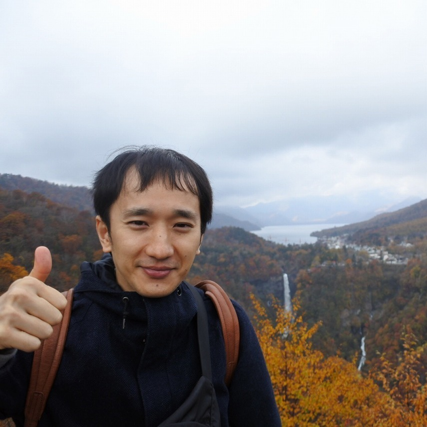

# collaborators

## [patrick.e.farrell](https://pefarrell.org/)

- **affiliation** <code>&#124;</code> [*university of oxford*](https://www.maths.ox.ac.uk/)
- **role** <code>&#124;</code> phd (dphil) co-supervisor
- **joint publications** <code>&#124;</code> [high-order conservative and accurately dissipative numerical integrators via auxiliary variables]({{ "/publications/sp-integrators/" | absolute_url }}), an augmented Lagrangian preconditioner for natural convection at high Reynolds number (upcoming\.\.\.)

## [p.alexei.gazca.o](https://gazcaorozco.github.io/home/)

- **affiliation** <code>&#124;</code> [*university of freiburg*](https://www.math.uni-freiburg.de/index.html)
- **joint publications** <code>&#124;</code> an augmented Lagrangian preconditioner for natural convection at high Reynolds number (upcoming\.\.\.)

## [wayne.arter](https://www.linkedin.com/in/wayne-arter-86375211/)

- **affiliation** <code>&#124;</code> [*culham centre for fusion energy (ccfe)*](https://ccfe.ukaea.uk/)
- **role** <code>&#124;</code> phd (dphil) co-supervisor

## [yuji.nakatsukasa](https://people.maths.ox.ac.uk/nakatsukasa/)

- **affiliation** <code>&#124;</code> [*university of oxford*](https://www.maths.ox.ac.uk/)
- **role** <code>&#124;</code> masters thesis supervisor
