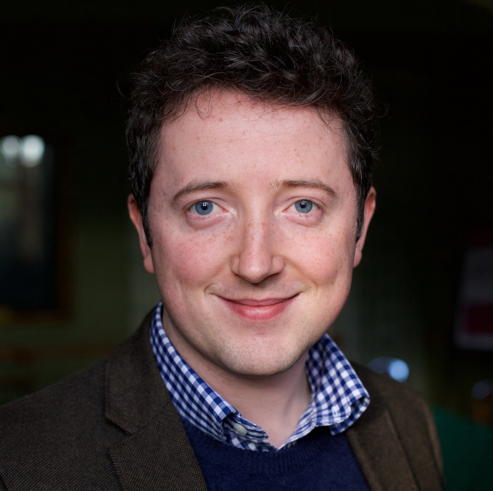

hi ! i'm boris andrews, and i'm a phd (dphil) student in the [numerical analysis research group](https://www.maths.ox.ac.uk/groups/numerical-analysis) at the [university of oxford](https://www.maths.ox.ac.uk/) working on structure-preserving numerical methods for pdes, under a joint [epsrc](https://www.ukri.org/councils/epsrc/) / [ccfe](https://ccfe.ukaea.uk/) studentship

 

## interests

- structure-preserving numerical methods for pdes / odes
- finite element theory (incl. mgrit / feec)
- hybrid fluid-particle models
- turbulent systems (incl. stabilisation / preconditioning)

 

## short cv

- **2021–2025** <code>&#124;</code> phd (dphil) in mathematics (numerical analysis), [*university of oxford*](https://www.maths.ox.ac.uk/)
    - **thesis** <code>&#124;</code> high-order conservative and accurately dissipative numerical integrators via auxiliary variables
    - **supervisors** <code>&#124;</code> [patrick.e.farrell](https://pefarrell.org/), [wayne.arter](https://www.linkedin.com/in/wayne-arter-86375211/)
- **aug–oct 2022** <code>&#124;</code> physics: theory and modelling internship, [*tokamak energy*](https://tokamakenergy.com/)
  
- **2017–2021** <code>&#124;</code> masters in mathematics (mmath), [*university of oxford*](https://www.maths.ox.ac.uk/)
    - **grade** <code>&#124;</code> first (distinction)
    - **thesis** <code>&#124;</code> computation and approximation properties of near orthogonal matrices for tall random matrices
    - **supervisor** <code>&#124;</code> [yuji.nakatsukasa](https://people.maths.ox.ac.uk/nakatsukasa/)
- **jul–aug 2019** <code>&#124;</code> computational fluid dynamics internship, [*perm state university*](http://en.psu.ru/)

[view all]({{ "/cv/" | absolute_url }})

 

## highlighted publications & preprints



[view all]({{ "/publications/" | absolute_url }})

 

## highlighted talks

[view all]({{ "/talks/" | absolute_url }})

 

## recent collaborators

### [patrick.e.farrell](https://pefarrell.org/), [*university of oxford*](https://www.maths.ox.ac.uk/)

### [p.alexei.gazca.o](https://gazcaorozco.github.io/home/), [*university of freiburg*](https://www.math.uni-freiburg.de/index.html)

[view all]({{ "/collaborators/" | absolute_url }})
