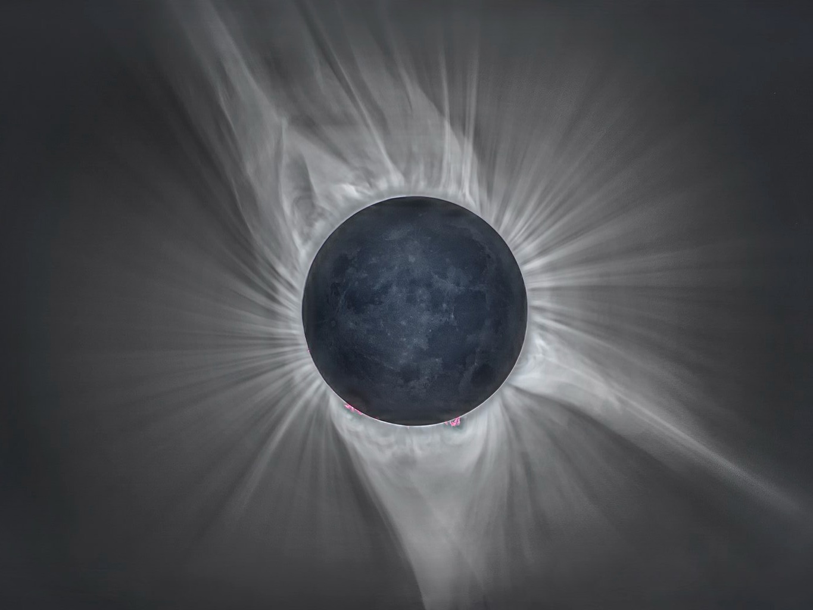
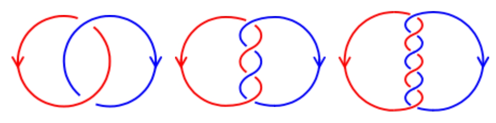
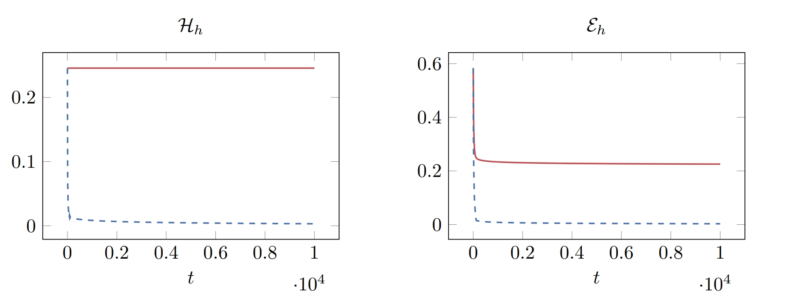
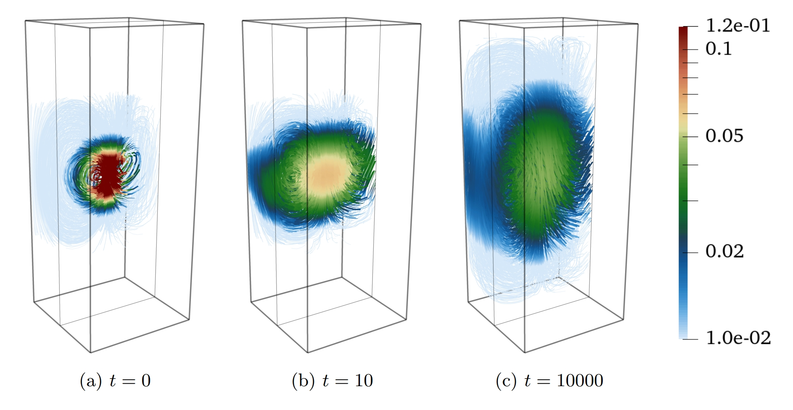

  ---
title: MAGNETIC RELAXATION
permalink: /publications/parker/
---

# HELICITY-PRESERVING FINITE ELEMENT DISCRETIZATION FOR MAGNETIC RELAXATION

###  <code>&#124;</code>  <code>&#124;</code>  <code>&#124;</code> Boris Andrews

### 20.JAN.2025 ([arXiv](https://doi.org/10.48550/arXiv.2501.11654)) <code>&#124;</code> Upcoming ()



<b>
    CHECK OUT ON ARXIV!
</b>

> *[...] This work presents an **energy- and helicity-preserving** finite element discretization for the **magneto-frictional system**, for investigating the **Parker conjecture**. The algorithm **preserves a discrete version of the topological barrier** and a discrete Arnold inequality. [...]*



    <b>FULL ABSTRACT</b>
    

        The Parker conjecture, which explores whether magnetic fields in perfectly conducting plasmas can develop tangential discontinuities during magnetic relaxation, remains an open question in astrophysics.
        Helicity conservation provides a topological barrier during relaxation, preventing topologically nontrivial initial data relaxing to trivial solutions;
        preserving this mechanism discretely over long time periods is therefore crucial for numerical simulation.   
        This work presents an energy- and helicity-preserving finite element discretization for the magneto-frictional system, for investigating the Parker conjecture.
        The algorithm preserves a discrete version of the topological barrier and a discrete Arnold inequality.
        We also discuss extensions to domains with nontrivial topology.
    

The results of this work are, to me, *tremendously exciting*.
They demonstrate how vital it is, when designing a numerical simulation, that you **preserve your conservation and dissipation laws** from the continuous level to the discrete.

*Magnetic relaxation* is the process by which a magnetic or **magnetohydrodynamic (MHD)** system **converges to its equilibrium/steady state**.
These systems are typically long-duration, large-scale plasmas (e.g. the Sun, in particular its corona visible in the photo below) or liquid metals (e.g. the Earth's core).

In this work, we develop **accurate numerical simulations** for a certain **magnetic relaxation** model: *the magneto-frictional equations*.

    <b>MAGNETO-FRICTIONAL EQUATIONS</b>
    

        \[
            \dot{\mathbf{B}} + \mathrm{curl}\,\mathbf{E} = \mathbf{0},  \\
            \mathbf{E} + \mathbf{u}\times\mathbf{B} = \mathbf{0},  \\
            \mathbf{j} = \mathrm{curl}\,\mathbf{B},  \\
            \mathbf{u} = \mathbf{j}\times\mathbf{B},
        \]
        where \(\mathbf{E}, \mathbf{B}\) are the electric and magnetic fields (respectively) and \(\mathbf{u}, \mathbf{j}\) are the fluid's internal velocity and current (respectively).
    

The magneto-frictional equations **conserve** a quantity called the *helicity*, \\(\mathcal{H}\\), and **dissipate** a quantity called the *energy*, \\(\mathcal{E}\\).

    <b>DEFINITIONS FOR \(\mathcal{H}, \mathcal{E}\)</b>
    

        \[
            \mathcal{H} \coloneqq \int\mathbf{A}\cdot\mathbf{B},  \qquad
            \mathcal{E} \coloneqq \int\mathbf{B}\cdot\mathbf{B},
        \]
        where \(\mathbf{A}\) is the magnetic potential satisfying \(\mathbf{B} = \mathrm{curl}\,\mathbf{A}\).
    

If \\(\mathcal{E}\\) ever hits \\(0\\), the system has necessarily relaxed to a *trivial steady state*, i.e. the magnetic field has simply vanished everywhere.
The interest thing however is that **this should never be the case**.  
A simple inequality, the *Arnold inequality*, says that \\(\mathcal{E}\\) **can not pass below a certain multiple of** \\(\mathcal{H}\\);
since \\(\mathcal{H}\\) is constant, this means \\(\mathcal{E}\\) can never reach \\(0\\).
In the equilibrium state therefore, the **magnetic field should not vanish**.

    <b>FUN TOPOLOGICAL DIVERSION</b>
    

        This has a neat <em>topological</em> interpretation!
        The helicity \(\mathcal{H}\) can be interpreted as a continuous analogue of an idea from <b>knot theory</b>: the <em>linking number</em>.
        This represents the number of times a pair of loops winds around each other (1, 2, 3 in the image below).   
          
        Essentially, \(\mathcal{H}\) quantifies how <b>knotted</b> the intial magnetic field is.
        The conservation of \(\mathcal{H}\) implies that magnetic relaxation <b>cannot untie these knots</b>.  
        It should <b>loosen them</b>, but <b>never untie them</b>.
    

While these structures exist on the continuous level, they are not necessarily preserved in any old simulation.
In particular, **existing numerical schemes typically do not conserve** \\(\mathcal{H}\\).  
In our work, we construct a numerical scheme that **conserves** \\(\mathcal{H}\\) **exactly**;
you can compare our scheme (solid red lines) with the typical scheme (dashed blue line) in which \\(\mathcal{H}\\) dissipates to \\(0\\) in the figure below.
Together with the Arnold inequality, this ensures \\(\mathcal{E}\\) cannot decay to \\(0\\)...

...and that the **computed magnetic field will not artificially vanish**!

I'd like to conclude this by emphasising:
*this is essentially the **first magnetic relaxation simulation that does not artificially dissipate to nothing***.  
This means it's the first that can be used to investigate these equations' long-term behaviour.
The *Parker conjecture* supposes that ideal magnetic relaxation may develop tangential discontinuities;
our scheme should prove vital for numerical investigations into its validity.

We hope our work can both **motivate the use of conservative/structure-preserving integrators**, and introduce **numerical discretisations** as a valid tool for **investigations into the Parker conjecture**.

<b>
    CHECK OUT ON ARXIV!
</b>

*We would all gladly discuss it further!*
- <a href="mailto:mingdong.he@maths.ox.ac.uk">mingdong.he@maths.ox.ac.uk</a>
- <a href="mailto:patrick.farrell@maths.ox.ac.uk">patrick.farrell@maths.ox.ac.uk</a>
- <a href="mailto:kaibo.hu@ed.ac.uk">kaibo.hu@ed.ac.uk</a>
- <a href="mailto:boris.andrews@maths.ox.ac.uk">boris.andrews@maths.ox.ac.uk</a>

## VIDEOS

You can find some discussion of this work in Patrick's **Langtangen Seminar** (22.APR.2025) at *[Simula](https://www.simula.no/)*, on our [earlier more general work on geometric numerical integrators](/publications/sp-integrators-a/), below:



    <iframe src="https://www.youtube.com/embed/wfFcZsxicw0" frameborder="0" allowfullscreen></iframe>

 

## RELATED WORKS

This scheme can be viewed as a **special case of my previous work** with , on [general constructions for conservative finite element integrators](/publications/sp-integrators-a/).

## RELATED OPEN PROBLEMS





## CO-AUTHORS

### 

### 

### 

## TALKS



  

    

      

        <h3 class="title">2025</h3>
        
<ul>
          
<strong>⬇️ PAST ⬇️</strong>

          <li>ECCOMAS MFET, <em>Aachen, Germany</em></li>
          <li>ACOMEN, <em>Ghent University</em></li>
          <li>ACM Colloquium, <em>University of Edinburgh & Heriot-Watt Unversity</em></li>
          <li>METHODS Group Seminar, <em>Brown University</em></li>
        </ul>

      

    

  

