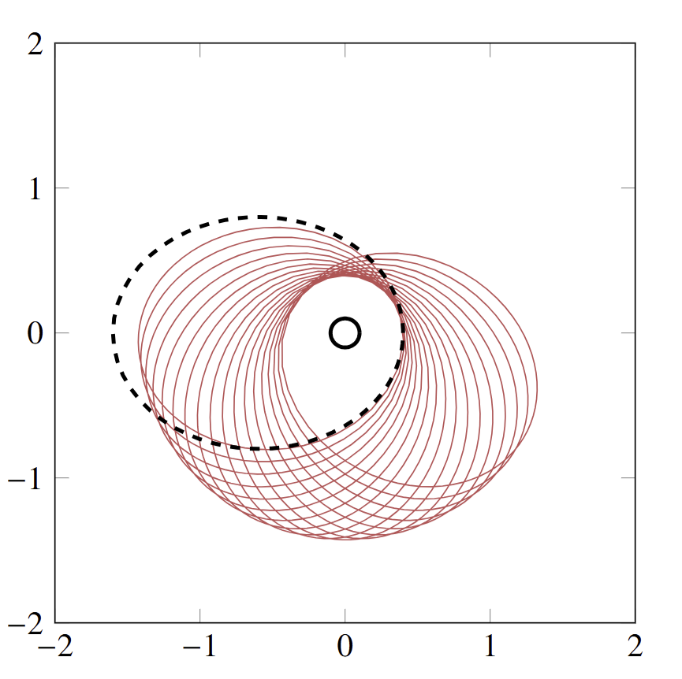
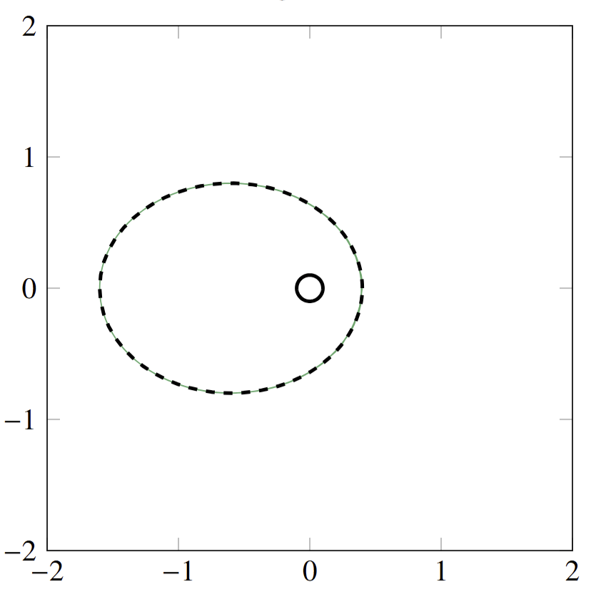
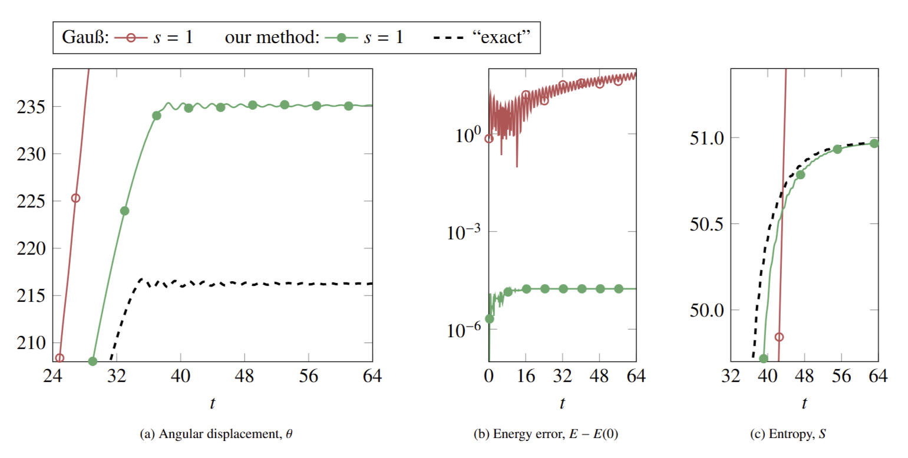

# CONSERVATIVE AND DISSIPATIVE DISCRETISATIONS OF MULTI-CONSERVATIVE ODEs AND GENERIC SYSTEMS

### Boris Andrews <code>&#124;</code> 

### 28.NOV.2025 ([arXiv](https://doi.org/10.48550/arXiv.2511.23266)) <code>&#124;</code> In review ()



<b>
    CHECK OUT ON ARXIV!
</b>

> *[...] we present two novel contributions: (i) an arbitrary-order time discretisation for **general conservative ordinary differential equations** that **conserves all known invariants** and (ii) an **energy-conserving** and **entropy-dissipating** scheme for [...] differential equations written in the **GENERIC** format [...]. We illustrate the advantages of our approximations with numerical examples of the **Kepler** and **Kovalevskaya problems**, a **combustion engine model**, and the **Benjamin–Bona–Mahony** equation.*



    <b>FULL ABSTRACT</b>
    

        Partial differential equations (PDEs) describing thermodynamically isolated systems typically possess conserved quantities (like mass, momentum, and energy) and dissipated quantities (like entropy).
        Preserving these conservation and dissipation laws on discretisation in time can yield vastly better approximations for the same computational effort, compared to schemes that are not structure-preserving.   
        In this work we present two novel contributions: (i) an arbitrary-order time discretisation for general conservative ordinary differential equations that conserves all known invariants and (ii) an energy-conserving and entropy-dissipating scheme for both ordinary and partial differential equations written in the GENERIC format, a superset of Poisson and gradient-descent systems.
        In both cases the underlying strategy is the same: the systematic introduction of auxiliary variables, allowing for the replication at the discrete level of the proofs of conservation or dissipation.
        We illustrate the advantages of our approximations with numerical examples of the Kepler and Kovalevskaya problems, a combustion engine model, and the Benjamin-Bona-Mahony equation.
    

You can view this preprint as the *"spiritual successor"* to my [previous work](/publications/sp-integrators-a/) with .
In Part 1, we showed how one can jointly employ **auxiliary variables** and **finite elements in time** to preserve multiple, general conervation laws and dissipation inequalities in our PDE disrcetisations.
This was exciting work, as classical approaches for constructing timestepping schemes (such as Runge–Kutta methods and symplectic integrators) typically fail to preserve the behaviour of non-quadratic invariants, and other bespoke structure-preserving integrator were typically limited to a maximum of one preserved quantity of interest.

Now in Part 2, we show just how powerful this idea can be, with two related examples...

### Multi-conservative ODEs

*Many* physical systems have *many* invariants.

Let me fix ideas with somewhat of a canonical example (one which we consider in the manuscript):
the **Kepler problem**, a simple 2-body gravitional system, e.g. for a planet orbiting a star.
Of course **energy** is conserved;
that's always the case.
But there's also the **angular momentum**, which encodes the speed of the orbit.
And then, less famously, there's a final conserved invariant of the [**Runge-Lenz (RL) vector**](https://en.wikipedia.org/wiki/Laplace%E2%80%93Runge%E2%80%93Lenz_vector), which encodes the;
conservation of the RL vector prevents a planetary orbits from [precessing](https://en.wikipedia.org/wiki/Apsidal_precession).

Implicit midpoint would here conserve energy and angular momentum—*both are quadratic*—both it won't conserve the non-polynomial RL vector.
Naturally then, despite it being wideplace and well loved in the literature, such simulations exhibit some pretty shocking unphysical precession.

In this recent manuscript,  use our [auxiliary variable framework](/publications/sp-integrators-a/) to construct a an integrator for **general ODE systems** with **multiple invariants** that conserves **every known invariant**.

Simulations of the Kepler problem (above) and the [Kovalevskaya top](https://en.wikipedia.org/wiki/Lagrange,_Euler,_and_Kovalevskaya_tops#Kovalevskaya_top) show some really substantial improvements in the quality of the numerical solutions.

### GENERIC systems

The [GENERIC formalism](https://en.wikipedia.org/wiki/GENERIC_formalism/) is somewhat of a *"grand unified theory"* for non-equilibrium thermodynamics.
It describes systems that simultaneously exhibit both:
- **Reversible dynamics** (like Hamiltonian mechanics) with a *conserved energy*.
- **Irreversible dynamics** (like friction or heat diffusion) with a *generated entropy*.

It's like an extension of Hamiltonian mechanics that doesn't just incorporate the **First Law of Thermodynamics** *(energy conservation)*, but the **Second Law** *(entropy generation)* too.



    <b>FULL DETAILS</b>
    

        The general GENERIC ODE in \(\mathbf{x} : \mathbb{R}_+ \to \mathbb{R}^d\) is
        \[
            \dot{\mathbf{x}}  =  L(\mathbf{x})\nabla E(\mathbf{x}) + M(\mathbf{x})\nabla S(\mathbf{x}).
        \]
        Here, \(E, S : \mathbb{R}^d \to \mathbb{R}\) are the (conserved) energy and (non-decreasing) entropy, and \(L, M : \mathbb{R}^d \to \mathbb{R}^{d\times d}\) are the skew-symmetric (Poisson) matrix and positive semidefinite (friction) matrix.
        With the following orthogonality conditions,
        \[
            \nabla S(\mathbf{x})^\top L(\mathbf{x}) = 0,  \qquad
            \nabla H(\mathbf{x})^\top M(\mathbf{x}) = 0,
        \]
        the conservation of \(E\) and non-dissipation of \(S\) can be identified by testing against \(\nabla E\) and \(\nabla S\) respectively.
        Extending to PDEs is fiddly (for the introduction of Fréchet derivatives) but similar.
    

As the name suggests, this is **extremely general**.
Examples of such systems include:
- the *compressible* Navier–Stokes equations;
- the Boltzmann equation;
- pretty much any *irreversible* thermodynamic system.

Simulating these accurately is ***tricky***.
Despite being a simple modification to a Hamiltonian system, the introduced dissipative component means symplectic integrators can really fail quite badly.

In the manuscript, for example, we consider a simple dissipative thermodynamic engine, that should *in theory* slow to a halt.
Using implicit midpoint *(red)* however, we find the numerical solution can perform as bad as to accelerate faster and *faster* and *FASTER*, until the solver fails *(and presumably the engine explodes)*.

We apply the framework from [our previous paper](/publications/sp-integrators-a/) to construct numerical integrators that preserve both the **conservative** and **dissipative** structures.
As such, we have a *general way to construct structure-preserving ODE integrators and finite element methods for any of the above systems*.
You can see the results with our comparable 1-stage scheme *(green)* in the figure above;
nice and dissipative!
For a PDE example, the manuscript presents an integrator for the **Boltzmann equation** that preserves both the **conservation of energy** and **generation of entropy**.

Preserving these properties is *crucial for accurately capturing the dynamics of these systems*.

<b>
    CHECK OUT ON ARXIV!
</b>

*We would both gladly discuss it further!*
- <a href="mailto:boris.andrews@maths.ox.ac.uk">boris.andrews@maths.ox.ac.uk</a>
- <a href="mailto:patrick.farrell@maths.ox.ac.uk">patrick.farrell@maths.ox.ac.uk</a>

## VIDEOS

Check out Patrick's **Langtangen Seminar** (22.APR.2025) at *[Simula](https://www.simula.no/)* below:



    <iframe src="https://www.youtube.com/embed/wfFcZsxicw0" frameborder="0" allowfullscreen></iframe>

 

His earlier **ACM Colloquium** (13.NOV.2024) at the  and  can be found [here](https://media.ed.ac.uk/media/13+11+2024+Patrick+Farrell+%28Oxford%29%3A+Designing+conservative+and+accurately+dissipative+numerical+integrators+in+time/1_o19b1nuj/245536282).

## RELATED WORKS

As stated above, the construction of the both schemes in this manuscript employ the framework presented **my earlier work** with , on [conservative and dissipative finite element integrators](/publications/sp-integrators-a/).

## RELATED OPEN PROBLEMS







## TALKS



    

      

        <h3 class="title">2026</h3>
        
<ul>
          <li>ECCOMAS WCCM, <em>Munich</em></li>
          
<strong>⬆️ UPCOMING ⬆️</strong>

        </ul>

      

    

    

      

        <h3 class="title">2025</h3>
        
<ul>
          
<strong>⬇️ PAST ⬇️</strong>

          <li>Biennial Numerical Analysis Conference, <em>University of Strathclyde</em></li>
          <li><strong>Numerical Mathematics & Scientific Computing Seminar, <em>Rice University</em></strong></li>
          <li><strong>SIAM CSE, <em>Fort Worth, Texas</em></strong></li>
          <li><strong>Scientific Computing Seminar, <em>Brown Unversity</em></strong></li>
        </ul>

      

    

    

      

        <h3 class="title">2024</h3>
        
<ul>
          <li>External ("tiny desk") Seminar, <em>Rice University</em></li>
          <li>Computing Division Technical Meeting, <em>UKAEA</em></li>
          <li>Firedrake User Meeting, <em>University of Oxford</em></li>
          <li>PDEsoft, <em>University of Cambridge</em></li>
          <li>Finite Element Fair, <em>University College London (UCL)</em></li>
          <li><strong>Exploiting Algebraic and Geometric Structure in Time-integration Methods workshop, <em>University of Pisa</em></strong></li>
          <li>UKAEA PhD Student Engagement Day, <em>UKAEA</em></li>
          <li>Junior Applied Mathematics Seminar, <em>University of Warwick</em></li>
        </ul>

      

    

    

      

        <h3 class="title">2023</h3>
        
<ul>
          <li><strong>ICIAM, <em>Waseda University</em></strong></li>
          <li>Numerical Analysis Group Internal Seminar, <em>University of Oxford</em></li>
          <li>Junior Applied Mathematics Seminar, <em>University of Oxford</em></li>
          <li>Met Office Presentation, <em>University of Oxford</em></li>
        </ul>

      

    

  

