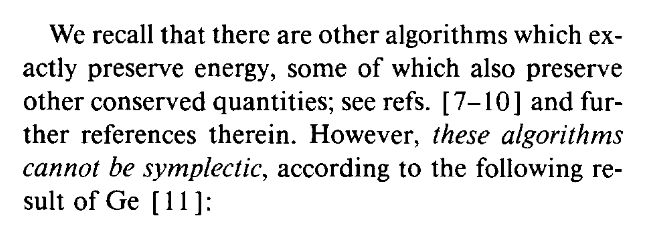
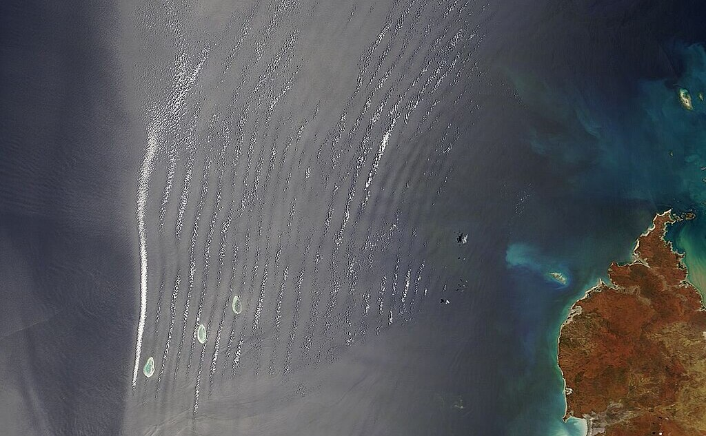

# HIGH-ORDER CONSERVATIVE AND ACCURATELY DISSIPATIVE NUMERICAL INTEGRATORS VIA AUXILIARY VARIABLES

### Boris Andrews <code>&#124;</code> 

### 16.JUL.2024 ([arXiv](https://arxiv.org/abs/2407.11904v2)) <!-- <code>&#124;</code> This manuscript is currently being partitioned into 2 parts -->



    THIS MANUSCRIPT IS CURRENTLY BEING PARTITIONED INTO MULTIPLE SUBMISSIONS  
    <b>CLICK HERE TO CHECK OUT PART 1!</b>

> *[...] we propose an approach for the construction of **timestepping schemes** that **preserve dissipation laws** and **conserve multiple general invariants**, via finite elements in time and the systematic introduction of auxiliary variables. [...] We [devise] novel arbitrary-order schemes that conserve to machine precision **all known invariants of Hamiltonian ODEs** [...] and arbitrary-order schemes for the **compressible Navier–Stokes equations that conserve mass, momentum, and energy, and provably possess non-decreasing entropy**.*



    <b>FULL ABSTRACT</b>
    

        Numerical methods for the simulation of transient systems with structure-preserving properties are known to exhibit greater accuracy and physical reliability, in particular over long durations.
        However, there remain difficulties in devising geometric numerical integrators that preserve dissipation laws and conserve non-quadratic invariants.   
        In this work, we propose a framework for the construction of timestepping schemes that preserve dissipation laws and conserve multiple general invariants.
        The framework employs finite elements in time and systematically introduces auxiliary variables;
        it extends to arbitrary order in time.
        We demonstrate the ideas by devising novel integrators that conserve (to machine precision) all known invariants of general conservative ODEs, energy-conserving finite-element discretisations of general Hamiltonian PDEs, and finite-element schemes for the compressible Navier-Stokes equations that conserve mass, momentum, and energy, and provably possess non-decreasing entropy.
        The approach generalises and unifies several existing ideas in the literature, including Gauss methods, the framework of Cohen & Hairer, and the energy- and helicity-conserving scheme of Rebholz.
    

While the results of this work are more general, I would like to provide some exposition for it through the lens of:
- Hamiltonian systems
- symplectic integrators
- the Benjamin--Bona--Mahony (BBM) equation

I find these results be informative, curious, motivating, and (not least) *cool*!

Symplectic integrators are frequently lauded for their *"energy-conserving properties"*.
Their status as the gold standard for simulating Hamiltonian systems is often put down to this.  
Yet, this belief is *not entirely accurate*.

**Symplecticity** enhances the collective behaviour of a group of simulations, which is beneficial! However, it **does not guarantee energy conservation**.  
In fact, as noted by [*Ge and Marsden (1988)*](https://doi.org/10.1016/0375-9601(88)90773-6):  
> *Symplectic integrators cannot\* conserve energy.*  
> *(\*in general)*

This limitation is evident in the *Benjamin–Bona–Mahony (BBM)* equation, a model for phenomena including long water waves.  
**Solutions to the BBM equation conserve energy**, \\(\int(\frac{1}{2}u^2 + \frac{1}{6}u^3)\\), contributing to their stability and persistence over time.

Simulating the BBM equations using the 2-stage Gauss method, a **symplectic integrator**, we observe a **gradual decline in the simulated energy**.  
This decline manifests as *artificial, unphysical oscillations in the solution*.

<video controls style="width: 100%; height: auto;">
    <source src="assets/vid/no_av.mp4" type="video/mp4">
    Your browser does not support the video tag.
</video>

    <b>FULL INTEGRATOR SPECIFICATIONS</b>
    

        The full BBM equation is
        \[
            \dot{u} - \dot{u}_{xx} = - u_x - uu_x.
        \]
        Define the domain \(\Omega \coloneqq (-50, 50)\).
        Up to projection, take initial conditions to be a soliton of speed \(\frac{1 + \sqrt{5}}{2}\),
        \[
            u(0)  =  \frac{3\sqrt{5} - 3}{2}{\rm sech}\!\left(\!\left(\sqrt{5} - 1\right)x\right)^2,
        \]
        and assume periodic boundary conditions.
        Define \(U\) to be the space of Hermite finite elements of uniform width 2, and take a uniform timestep \(1\).  
        Take the following semidiscrete variational formulation:
        find \(u \in C^1(\mathbb{R}_+; U)\) such that for all \(v \in U\),
        \[
            \int_\Omega(\dot{u}v + \dot{u}_xv_x)  =  \int_\Omega\!\left(u + \frac{1}{2}u^2\right)v_x,
        \]
        at all times \(t \in \mathbb{R}_+\).
        Discretise this in time using the 2-stage Gauss method.  
        The above video is at time \(20000\) with a moving camera of speed \(\frac{1 + \sqrt{5}}{2}\).
    

In our [preprint](https://arxiv.org/abs/2407.11904v2),  and I propose a framework to modify numerical time discretisations to preserve conservation laws exactly. We achieve this through:
- **Finite elements in time**
- The systematic introduction of **auxiliary variables**

    <b>TECHNICAL NOTE ON SYMMETRY</b>
    

        N.B. Unlike other techniques for the construction of energy-conserving schemes (e.g. projection methods) this approach <i>preserves the symmetry</i> of the initial timestepping scheme, another property that is crucial for realistic simulations.
    

Applying our framework to Hamiltonian systems (incl. the BBM equation) we derive a general Hamiltonian integrator with exact energy conservation.
Simulating the BBM equations using the ***modified* 2-stage Gauss method**, we observe **exact energy conservation** in the simulation.
This *avoids the artificial oscillations* and provides far more qualitatively accurate results.  
(Note: The video *should* appear stationary. It's loading fine; this is the correct solution behaviour!)

<video controls style="width: 100%; height: auto;">
    <source src="assets/vid/av.mp4" type="video/mp4">
    Your browser does not support the video tag.
</video>

    <b>FULL INTEGRATOR SPECIFICATIONS</b>
    

        Over a timestep \(T_n = [t_n, t_{n+1}]\), define the space-time finite element space
        \[
            X_n \coloneqq \{u \in P_2(T_n; U) : u(t_n) \text{ satisfies known initial data}\},
        \]
        where \(P_s(T_n; U)\) is the space of degree-\(s\) polynomials from \(T_n\) to \(U\).
        Note that \(\dot{X}_n = P_1(T_n; U)\).  
        Take the following fully discrete variational formulation over \(T_n\):
        find \((u, \tilde{w}) \in X_n \times \dot{X}_n\) such that for all \((v, \tilde{v}) \in \dot{X}_n \times \dot{X}_n\),
        \[
            \int_\Omega(\dot{u}v + \dot{u}_xv_x)  =  \int_\Omega(\tilde{w}v_x + \tilde{w}_xv_{xx}),  \\
            \int_\Omega(\tilde{w}\tilde{v} + \tilde{w}_x\tilde{v}_x)  =  \int_\Omega\left(u + \frac{1}{2}u^2\right)\tilde{v}_x.
        \]
        The introduced auxiliary variable \(\tilde{w}\) as introduced by our framework approximates \((1 - \partial_x^2)^{-1}\!\left[u + \frac{1}{2}u^2\right]\!\).
        We can see this scheme conserves \(H\) over \(T_n\) by taking \((v, \tilde{v}) = (\tilde{w}, \dot{u})\).  
        Again, the above video is at time \(20000\) with a moving camera of speed \(\frac{1 + \sqrt{5}}{2}\).
    

Crucially however, our framework extends *beyond Hamiltonian systems*, and beyond conservation laws.
For instance, we use it to develop numerical schemes for the *compressible Navier–Stokes equations* that:
- **Conserve mass, momentum, and energy**
- **Increase total entropy**

<video controls style="width: 100%; height: auto;">
    <source src="assets/vid/compressible_ns.mp4" type="video/mp4">
    Your browser does not support the video tag.
</video>

    <b>FULL INTEGRATOR SPECIFICATIONS</b>
    

        Honestly, this is way too complicated for a little box on a website, sorry!
        Check out Section 5 of the preprint for the full details.
    

Further applications of the framework can be found in our [preprint](https://arxiv.org/abs/2407.11904v2), and we are actively pursuing many more at the moment!  
The framework is *general and powerful*. If you are investigating any type of transient system, we hope our work can provide a simple approach for generating more physically realistic simulations.

<b>
    CHECK OUT ON ARXIV!
</b>

*We would both gladly discuss it further!*
- <a href="mailto:boris.andrews@maths.ox.ac.uk">boris.andrews@maths.ox.ac.uk</a>
- <a href="mailto:patrick.farrell@maths.ox.ac.uk">patrick.farrell@maths.ox.ac.uk</a>

## VIDEOS

Check out Patrick's **Langtangen Seminar** (22.APR.2025) at *[Simula](https://www.simula.no/)* below:



    <iframe src="https://www.youtube.com/embed/wfFcZsxicw0" frameborder="0" allowfullscreen></iframe>

 

His earlier **ACM Colloquium** (13.NOV.2024) at the  and  can be found [here](https://media.ed.ac.uk/media/13+11+2024+Patrick+Farrell+%28Oxford%29%3A+Designing+conservative+and+accurately+dissipative+numerical+integrators+in+time/1_o19b1nuj/245536282).

## RELATED WORKS

This manuscript is currently being partitioned into multiple submissions.
Part 1, covering the **general framework** alongside **applications to the incompressible and compressible Navier–Stokes equations**, can be found [here](/publications/sp-integrators-a/).

For a neat application of these ideas to a problem in **magnetic relaxation** that really highlights their importance, check out my subsequent work with ,  & , on [structure-preserving integrators for the magneto-frictional equations](/publications/parker/).

## RELATED OPEN PROBLEMS
















## CO-AUTHORS

### 

## TALKS



    

      

        <h3 class="title">2026</h3>
        
<ul>
          <li>ECCOMAS WCCM, <em>Munich</em></li>
          
<strong>⬆️ UPCOMING ⬆️</strong>

        </ul>

      

    

    

      

        <h3 class="title">2025</h3>
        
<ul>
          
<strong>⬇️ PAST ⬇️</strong>

          <li>Biennial Numerical Analysis Conference, <em>University of Strathclyde</em></li>
          <li><strong>Numerical Mathematics & Scientific Computing Seminar, <em>Rice University</em></strong></li>
          <li><strong>SIAM CSE, <em>Fort Worth, Texas</em></strong></li>
          <li><strong>Scientific Computing Seminar, <em>Brown Unversity</em></strong></li>
        </ul>

      

    

    

      

        <h3 class="title">2024</h3>
        
<ul>
          <li>External ("tiny desk") Seminar, <em>Rice University</em></li>
          <li>Computing Division Technical Meeting, <em>UKAEA</em></li>
          <li>Firedrake User Meeting, <em>University of Oxford</em></li>
          <li>PDEsoft, <em>University of Cambridge</em></li>
          <li>Finite Element Fair, <em>University College London (UCL)</em></li>
          <li><strong>Exploiting Algebraic and Geometric Structure in Time-integration Methods workshop, <em>University of Pisa</em></strong></li>
          <li>UKAEA PhD Student Engagement Day, <em>UKAEA</em></li>
          <li>Junior Applied Mathematics Seminar, <em>University of Warwick</em></li>
        </ul>

      

    

    

      

        <h3 class="title">2023</h3>
        
<ul>
          <li><strong>ICIAM, <em>Waseda University</em></strong></li>
          <li>Numerical Analysis Group Internal Seminar, <em>University of Oxford</em></li>
          <li>Junior Applied Mathematics Seminar, <em>University of Oxford</em></li>
          <li>Met Office Presentation, <em>University of Oxford</em></li>
        </ul>

      

    

  

